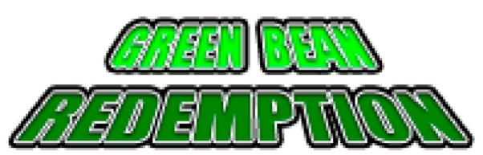
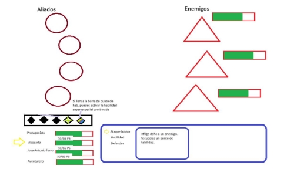
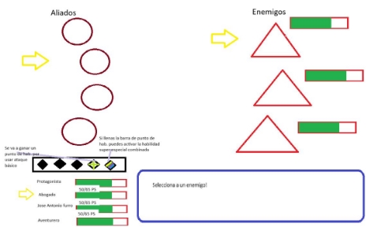
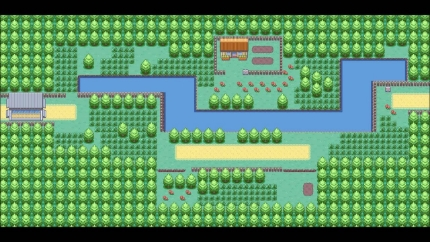

# greenGame1
Este proyecto es un trabajo realizado como práctica de la asignatura Programación de Videojuegos en Lenguajes Interpretados de la carrera de Desarrollo de Videojuegos en la Universidad Complutense de Madrid.

El equipo (Berdestudios) está conformado por los siguientes alumnos y somos los autores del contenido de este repositorio:

*Diego Montenegro Calvo, Jose Antonio Carmona Alfonsel, Javiel Alonso Ruiz, Pablo Marcos Serrano*

Green Bean Redemption\*

\*Nombre provisional

Documento de diseño de videojuego

**Ficha técnica**

Título: GREEN BEAN REDEMPTION Género: JRPG por turnos

Plataforma: Web (PC)

Modos de juego: Single player (modo historia)

**Descripción**

JRPG por turnos con al menos 8 judías basadas en las personalidades del test de 16 personalidades MBTI. En él, una party de 4 personajes que podremos ir intercambiando se enfrentarán a los signos del zodíaco.

**Jugabilidad:**
**Combate:**
- **Turno Jugador:**

El turno del jugador se divide en el turno de cada personaje. En este puede realizar tres acciones: un ataque singular a un enemigo, usar una habilidad especial o defenderse para reducir el daño sufrido el siguiente turno. Los turnos de los aliados suceden por orden descendente; después de haber actuado todos los aliados, les toca el turno a los enemigos. **Turno Enemigo:**

Todos los enemigos tendrán su turno al mismo tiempo. Excepto los jefes, todos los enemigos tienen solo un ataque. Cada aliado y enemigo tiene sus propios atributos de ataque, puntos de vida y defensa.

- **Barra de energía y habilidades:**

Cuando atacas o defiendes, ganas un punto de habilidad. Al usar una habilidad especial, usas un punto de habilidad. El número de puntos máximos está limitado por el tamaño de tu grupo (1 personaje = 2 puntos, 2 personajes = 3 puntos… 3 = 4ap, 4 = 5ap.

- **Estados:**

Cuando tu o el enemigo aplica un estado, este es permanente. Es decir, dura hasta que termine el combate o un aliado use una habilidad para limpiar los efectos negativos. Los únicos estados no permanentes son aturdimiento (te impide actuar) y el efecto de “defender” (reduce el daño), ambos duran 1 turno.

(Para un análisis más exhaustivo del combate, mire [https://docs.google.com/document/d/1kXGVp4Mx-cwQBXebSnZdqkZTm3BzLKB_HgMrWbR zE5g/edit](https://docs.google.com/document/d/1kXGVp4Mx-cwQBXebSnZdqkZTm3BzLKB_HgMrWbRzE5g/edit))

**Overworld**:
- **Movimiento:** El mapa mostrará una vista cenital con movimiento en ocho ejes. El jugador puede moverse por el mundo y entrar en combate contra los distintos enemigos que encontrará acercándose a ellos.
- **Enfrentarse a enemigos:** Cuando el jugador toca a uno de los enemigos del overworld, este se transporta a la zona de combate donde lucha en una batalla por turnos contra el enemigo.
- **Puntos de guardado:**
- **Recolección de objetos y reclutamiento:** Al derrotar ciertos enemigos, el jugador obtendrá objetos que podrá equipar en sus personajes. Los objetos confieren estadísticas adicionales para ayudar en el combate. (También puedes conseguirlos en lugares específicos fuera de combate?\*)
3. **Equipo y equipamiento:**
- **Personalización de compañeros:** Mientras el jugador está fuera de combate, puede acceder al menú de selección de equipo, en el que podrá crear libremente un equipo con hasta cuatro personajes.
- **Inventario y equipamiento:** Desde el menú de equipamiento, el jugador puede equipar los objetos que haya conseguido en sus personajes. Cada personaje sólo puede tener una cantidad limitada de objetos equipados.
**HUD**

**Mockup del HUD**

En este mockup podemos observar la disposición de los personajes y el comienzo del turno de acción del “Abogado”. El HUD muestra las opciones disponibles y dinámicamente enseña cómo cambiaría la barra de punto de habilidad si se realiza la acción del puntero.

Este mockup muestra la selección de enemigo tras pulsar sobre “ataque básico”.

**Visual**

Juego pixel art al estilo de los rpgs y jrpgs de la vieja escuela. Como fans de este tipo de juegos tomamos inspiración de muchos de ellos, si lo juegas verás ;3

**Controles**

El juego se jugará con controles de 4 direcciones, utilizando las flechas del teclado. Los menús también se navegarán con las flechas direccionales.

Para seleccionar se utilizará “Z” y para cancelar/ir atrás “X”.

No se podrá jugar con teclado (por lo menos no de salida).

**Contenido**
**Historia**

Nuestro protagonista, Judini, vivía una vida perfectamente feliz y tranquila, hasta que conoció a Judas, una chica del zodiaco. El pobre acabó perdidamente enamorado de ella, completamente inconsciente del error que estaba cometiendo. Sin saberlo, había hecho empezar el apocalipsis. Las figuras del zodiaco habían descendido desde el cielo para acabar con la humanidad. Solo Judini y otras 15 personalidades, podrán derrotar a los signos del zodiaco, salvar a la humanidad y convertirse en la pseudociencia superior.

La historia será contada a través de diálogos entre combates y otros momentos.

**Personajes y enemigos**
- -Judini: Protagonista de nuestra aventura. Representación de la personalidad “Protagonista”. Será el primer personaje que podremos controlar. La habilidad especial de Judini será lanzar un potente espadazo a un enemigo, tras lo cual curará a sus aliados.
- -Judas: Villana de la historia. Se desconoce sus objetivos o sus intenciones detrás del apocalipsis
- -12 Signos del Zodiaco: Enemigos contra los que lucharemos en esta aventura.
- -Otras 7 personalidades con aparición asegurada:
- Garbanzo con botas (Emprendedor): [Desc. personaje]. Su habilidad especial hará gran daño a un enemigo y le aumentará el ataque.
- (Comandante): [Desc. personaje]. Su habilidad especial dañará a todos los enemigos y les reducirá levemente su ataque
- (Logista): [Desc. Personaje]: Aumentará la defensa de todo su equipo con su defensa.
- (Animador): [Desc. Personaje]. Su potente ataque especial dañará a un enemigo con posibilidades de aturdir.
- (Lógico): [Desc. Personaje]. Sus venenos hacen que su habilidad especial aplique DoT a todos los enemigos.
  - (Cónsul): [Desc. Personaje]. Su habilidad especial centrada en un aliado incrementará sus capacidades tanto ofensivas como defensivas.
  - Greta Judberg (Activista): Al usar su habilidad especial curará a un aliado en gran medida y le sanará de cualquier efecto DoT negativo.
- 8 restantes:
  - Indiana Judión (Virtuoso): Se aumenta mucho el ataque a sí mismo
  - Mariano Rajoy (Ejecutivo): Aumenta el ataque de todo el equipo.
  - Saul Judman (Abogado): Cura a un aliado y le proporciona un escudo extra
  - Bealon Musk (Innovador): Lanza un cohete que daña a todos los enemigos con posibilidad de aturdirlos.
  - Jonny Bean (Mediador): Cura a todos los aliados y aumenta el ataque de uno en concreto
  - Garbanzo con Botas (Aventurero): Golpea a un enemigo y le aplica mucho DoT
  - (Arquitecto)
  - (Defensor): Aumenta mucho la defensa de un aliado y le proporciona un gran escudo
**Objetos**

Tras derrotar algunos enemigos, el jugador podrá recibir objetos. Estos objetos pueden otorgar atributos adicionales como más daño, más vida o más defensa, entre otras cosas. Pueden ser equipados a cualquier personaje, aunque hay un límite de objetos que un personaje puede equipar.

**Referencias**

Podemos entender el mapa del juego como el del Pokémon; rutas lineales con posibles encuentros por el camino y algunos rincones explorables que aún así no se desvían de la ruta principal.

El combate tiene un estilo de rpg clásico. Los turnos suceden uno tras otro sin interacción ni acción entre ellos. Sólo maravillosa estrategia.

La idea de gastar puntos de habilidad de una barra conjunta para el equipo y que obtengas puntos usando ataques básicos la hemos tomado de Honkai: Star Rail. Nos parece una mecánica muy interesante por su sencillez y la cantidad de toma de decisiones que añade al combate. ¿Quiero gastar mis puntos ahora para curar o prefiero generar más para después?

"Nadie sabe pues, qué deparará el destino... quizás la ambición ahogará el brote de vuestra empresa... quizás es sólo la primera semilla de algo mucho más grande... sea como sea; muy libra de tu parte."

- Augurio de la Judía Astral